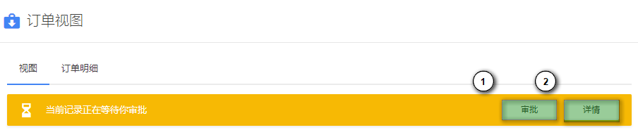

# 审批流程

RB 的审批流程能够支持复杂的多条件分支，可设置不同条件不同流程和审批人。支持指定审批人或自选审批人，审批结果抄送给指定用户。同时也支持多人审批会签与或签。

## 配置审批流程

### 添加审批流程

要添加审批流程，首先进入 管理后台 - 审批流程，然后点击页面右上角的 [添加] 按钮。

1. 流程名称
2. 流程所应用到的实体

选择/填写完成后点击 [确定] 按钮，系统将进入下一步对流程进行设计。

### 设置流程

1. 流程发起人，一般由记录所属用户发起，也可以设定由指定人员发起
2. 条件分支
3. 添加审批人、抄送人或新的条件分支
4. 审批人节点
5. 抄送人节点

> 流程设置完成后一旦开始被使用，将无法修改。如遇流程变动可以禁用并复制一个新的流程进行修改。

## 使用审批流程

当一个实体配置了审批流程后，其自动拥有了审批流程的相应能力，拥有了审批状态和数据约束。

- 草稿（新建记录时的默认状态）
- 审批中（审批已提交，但尚未被处理）
- 审批通过
- 驳回（审批拒绝）

> 如果审批状态为 *审批中* 或 *审批通过*，则记录为只读状态无法进行修改。

### 提交审批

当一条记录填写完成/完善后即可以提交审批，如果当前用户拥有提交审批的权限，在视图页面顶部会出现流程提交提示。

点击 [提交] 按钮进入流程提交页面。

由于RB 支持对一个实体启用多个审批流程，因此在 ① 处可能出现多个流程供提交人员选择。也有可能没有可用流程，此时作为管理员应该及时调整流程位置。

1. 选择使用哪个流程
2. 选择审批人或抄送人（是否可选取决于流程是否配置了允许自选）

最后点击 [提交] 按钮进行提交，相关审批人和抄送人（如有）会收到审批通知消息。

### 处理审批

流程提交后，审批人员可以在视图页进行审批。

1. 只有审批人员可以看到和进行审批
2. 可查看已进行/正在进行的审批节点、时间和审批人

点击 [审批] 按钮可打开审批页面。

1. 为本次审批添加批注
2. 审批结果抄送给指定用户（如有）或进入下一审批环节（如有）
3. 可以选择同意或驳回

