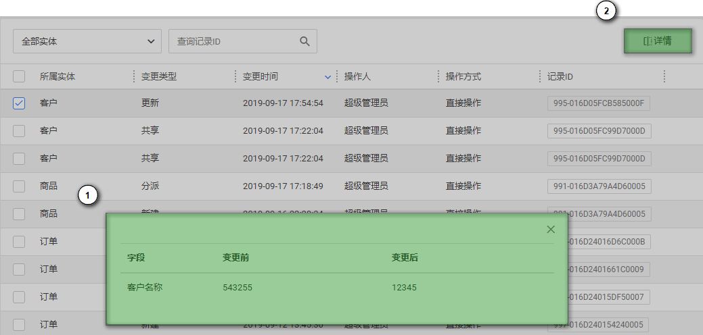
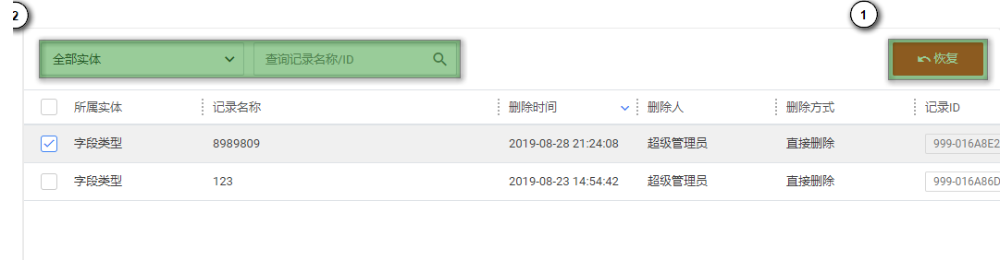

# 数据审计

## 概述

通过对用户使用数据行为的记录、分析和汇报，用来帮助事后生成合规报告、事故追根溯源，同时加强内外部数据行为记录，提高数据资产安全。

## 记录修改历史

记录修改历史完整的记录了关键业务操作和数据变更历史，当出现问题时有据可查。

1. 选中某条记录可查看变更详情（若有）
2. 变更详情（若有）

## 回收站

当记录被删除时，其在系统中仍旧留有备份。以便在误删除后进行恢复操作。

1. 查询回收站
2. 对勾选的数据进行恢复