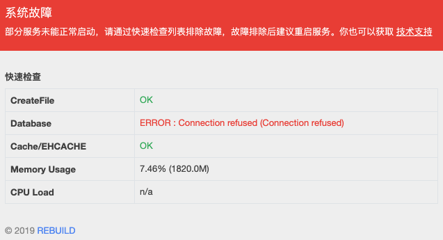

# 安装

## 系统环境准备

RB 依赖以下软件环境，在开始前请确保已经准备好以下软件。

- JDK/JRE 1.8+
- MySQL 5.6/5.7
- Redis 4.0+ （可选安装。如果不安装则使用内建的 EhCache）

> 以上软件均推荐使用 64 位版本。
>
> 对于硬件需求，主要取决于系统的并发量和数据量。如果只是作为测试使用，以现代电脑的普遍配置，即可以流畅运行。

## 下载 RB 安装包

你可以到 [RB 官网](https://getrebuild.com/download) 下载最新版安装包，也可以至 RB 的 [GitHub 项目](https://github.com/getrebuild/rebuild/) 页下载。一般情况下每个版本我们会同时提供源码和二进制安装包，安装包通常以 `-release.zip` 结尾。

## 开始安装

1. 在开始此步骤前，我们假定你已经完成了前述步骤。现在，将安装包解压到任意安装目录 
2. 在解压目录下找到 `.setup/db-init.sql` 文件，并将其导入到 MySQL 中，完成后你将得到一个初始数据库，数据库名称通常为 `rebuild**`
3. 确保第一节中所准备的依赖软件均为启动状态
4. 进入解压目录下的 `bin/` 目录，并双击 `startup.bat` （Windows）或 `startup.sh` （Linux/MacOS）启动 REBUILD
5. 启动后，打开浏览器并输入 `http://localhost:18080/` 访问

> 如果启动失败，系统会定向到服务状态页面，并显示失败原因。如下图所示

