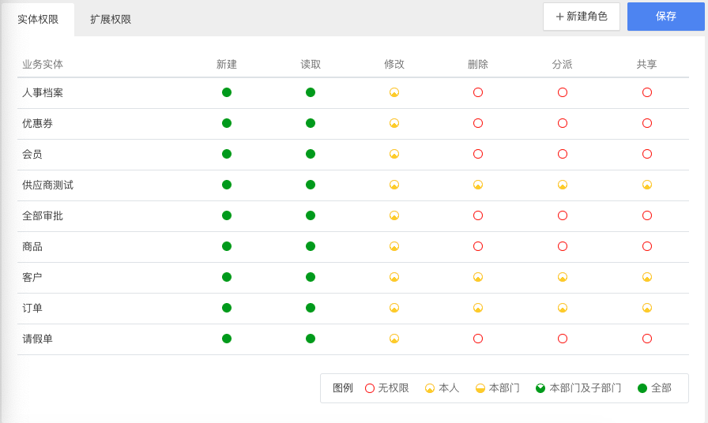

# 权限角色

## 概述

REBUILD 提供 [RBAC](https://baike.baidu.com/item/RBAC/1328788) 权限模型（基于角色的权限访问控制）。此权限模型是兼具简单易用、性能与安全性并存的综合性解决方案。

权限模型基于以下 3 个关键对象：

- 用户
- 部门
- 角色

其中，角色负责权限的定义，是一组权限的集合，用户最终将被赋予某种角色。而部门则负责权限的深度与层级，例如“允许查看本部门及子部门的客户纪录”。

> 目前，1 位用户只能赋予 1 种角色，未来我们将提供多角色支持。

## 操作类型

在 REBUILD 中定义了 6 种操作类型：

- 新建/创建
- 读取/查看
- 修改
- 删除
- 分派
- 共享

其中，除了 **新建** 没有操作层级外，其他均可以配置操作深度。如“仅能修改本人的客户纪录”，“可以查看所有客户纪录”，“不能删除任何客户纪录”。

