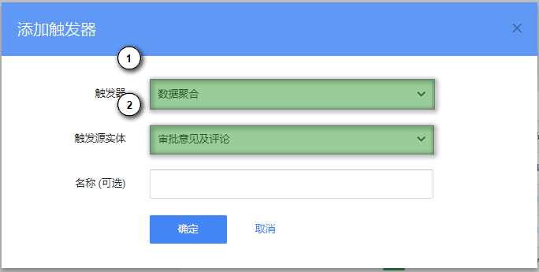
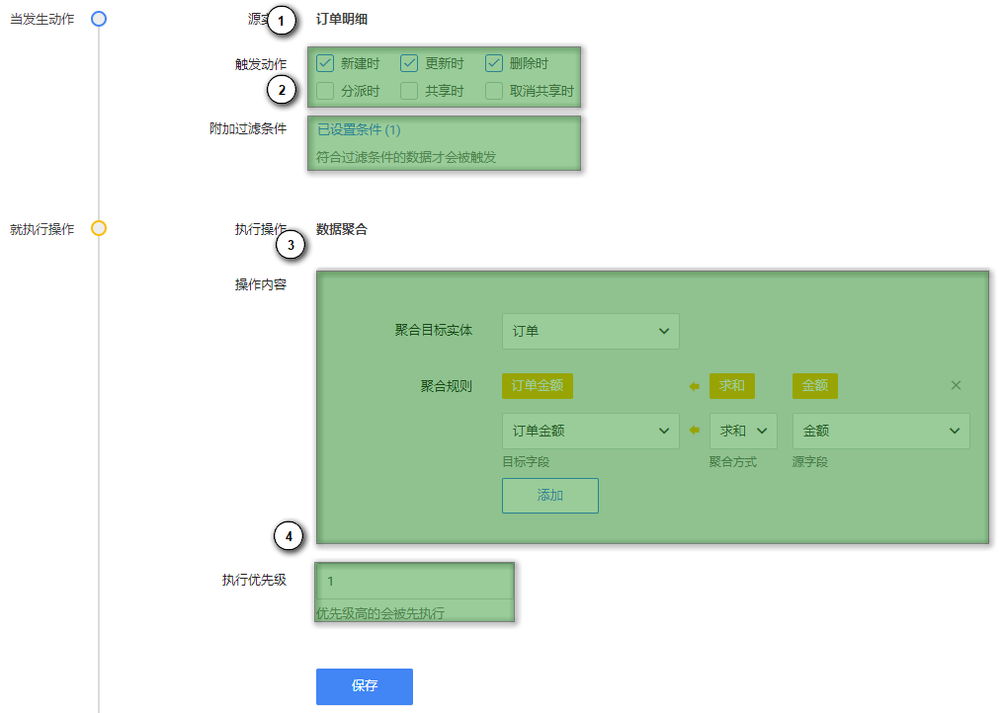
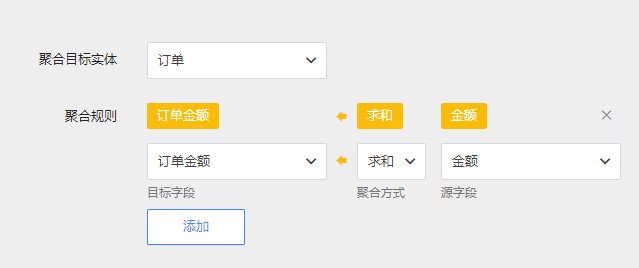
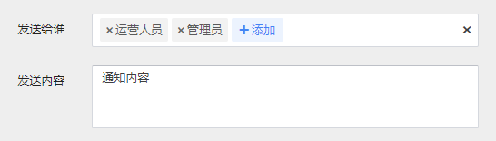
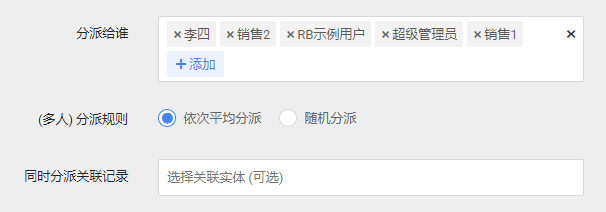
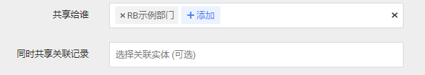

# 触发器

## 概述

触发器不是由外部程序调用，也不是手工执行，而是由事件来触发。触发器经常用于加强数据的完整性约束和业务规则等。

在 RB 中，你可以使用已经定义好触发器来完成特点的业务规则。这些触发器由以下几种事件来触发：

- 新建纪录时
- 更新纪录时
- 删除纪录时
- 分派纪录时
- 共享纪录时
- 取消共享纪录时

### 添加触发器

要添加触发器，首先进入 管理后台 - 触发器，然后点击页面右上角的 [添加] 按钮。

1. 选择触发器类型
2. 选择触发源实体

选择/填写完成后点击 [确定] 按钮，系统将进入下一步对触发器进行完整配置。

1. 当发生指定的事件时触发该触发器
2. 可以配置过滤条件排除某些数据
3. 根据不同的触发器类型，此处的触发内容也将不同
4. 如果一个实体有多个触发器，可以配置触发的时机（先后顺序）

## 配置触发器

目前系统提供了 4 种触发器，每种触发器都有对应的业务场景。我们将在后续版本继续提供更多的触发器种类，满足更多业务场景。

#### 数据聚合

数据聚合通常用于将某类数据进行汇总到指定字段，例如订单明细记录中的小计金额需要汇总到订单中（下图所示），计算客户名下的订单平均单价等等。

#### 发送通知（内部消息）

发送通知通常用于获知数据的变化，或当数据变化时通知相关用户。

#### 自动分派

自动分派可以将某一来源的数据分派给指定人员。例如一个新的客户资源产生，分配给销售人员以便其进行跟进。

#### 自动共享

