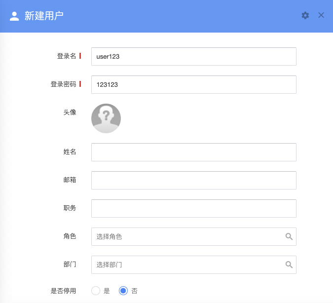

# 用户管理

## 添加用户

系统提供了两种添加用户的方式。

管理员可以直接在用户管理界面添加用户，为用户填写基本的信息，如用户名、姓名、职位、头像等。同时我们强烈建议填写用户邮箱，邮箱将用于接收系统通知，丢失/忘记密码后重置密码。如果在添加用户时填写了邮箱，系统还会自动将用户的登录信息（登录地址/用户名/密码）发送给用户，引导用户进行登录使用。

### 自助注册

管理员可以开启自助注册通道，用户注册后管理员会收到注册消息（站内消息）。需要注意的是，直到管理员为注册用户指定了部门和角色，用户才是有效的状态。

> 用户必须被指定角色和部门，否则将处于禁用状态。禁用的用户无法登录，也无法进行任何操作。