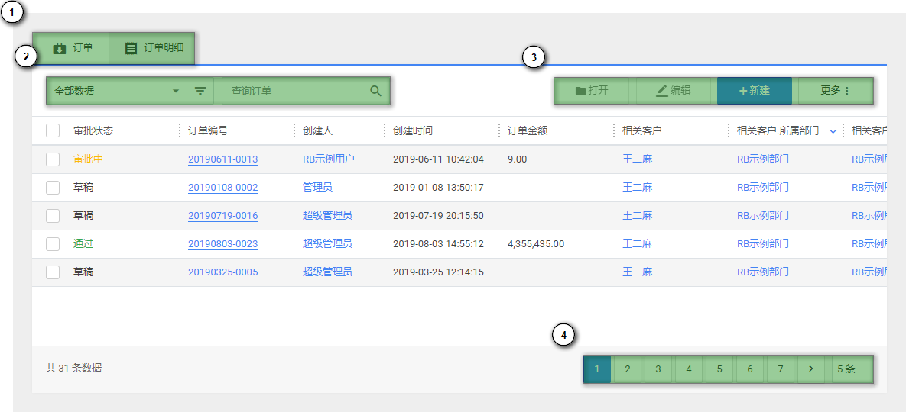
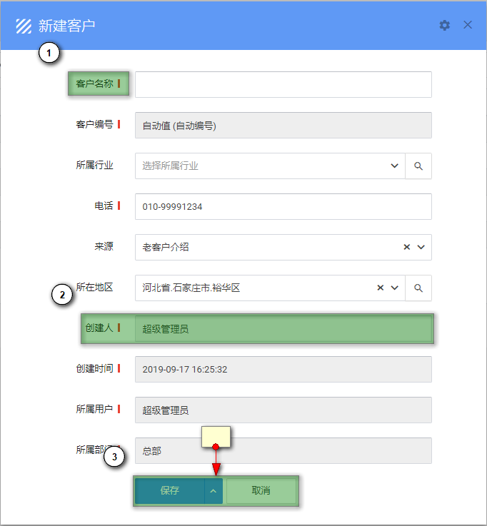
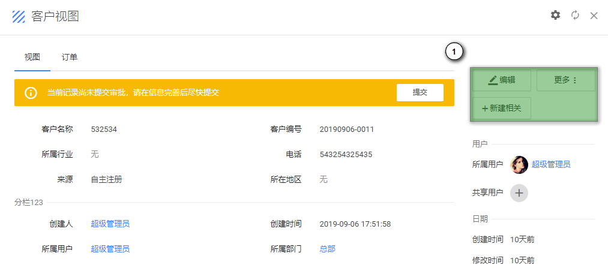
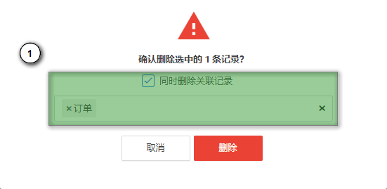

# 基本操作

## 列表操作

以上为一个典型的列表页面，中间部分列表数据，标注的区域分别为：

1. 顶部主记录/明细记录列表切换（如有）
2. 左侧查询区域（高级查询、快速查询）
3. 右侧操作区域（根据权限不同，此处所显示的操作按钮也不同）
4. 底部页码区域

在列表数据中，不同类型的字段显示样式有所不用。其中蓝色字体一般表示引用字段（如创建人），点击后会打开对应的视图页面。而点击带有下划线的蓝色文字（名称字段）则可以打开记录本身，也可以选择一条记录，并点击操作区域的 [打开] 按钮打开一条记录。

## 新建记录

在操作区域点击 [新建] 按钮即可打开新建页面，如下图所示

1. 带有红色标记的字段为必填
2. 显示灰色背景的为只读字段，一般由系统自动填写
3. 在填写完成后，点击 [保存] 按钮完成记录新建

## 更新记录

有两种方式可以编辑现有记录。

1. 在列表页选中一条记录，然后点击操作区域的 [编辑] 按钮
2. 在记录的视图页面，点击右侧操作区域的 [编辑] 按钮（如下图所示）

## 删除记录

记录可以被直接删除，也可以被间接删除。与更新记录相同，也有两种删除方式。

1. 在列表页选中一条记录，然后点击操作区域的 [更多] - [删除] 按钮
2. 在记录的视图页面，点击右侧操作区域的 [更多] - [删除] 按钮

### 关联删除（间接删除）

有时，我们在删除记录的同时，希望将引用此记录的其他记录一并删除。只需在删除确认框中勾选 [同时删除关联记录]，并选择需要删除的关联实体即可。

> 如果记录被误删除，管理员可以在回收站中将其恢复。