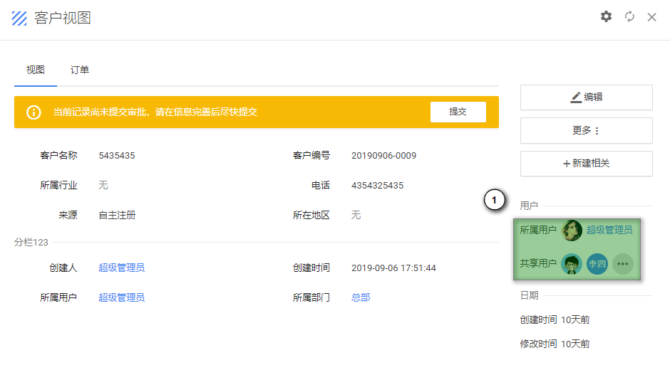
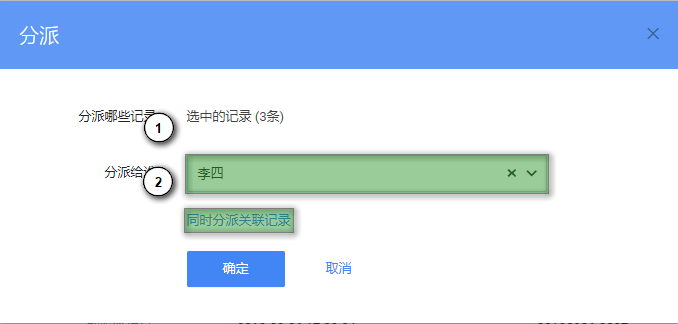
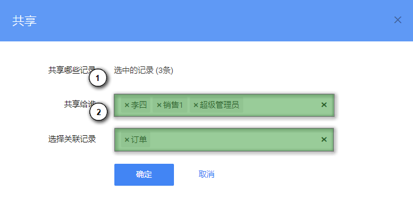

# 分派与共享

## 概述

每一条业务记录都归属于某一用户（所属用户），权限体系也以此为基础形成。所属用户不能直接进行修改，需要通过“分派”进行修改。如果需要将某些记录的查看权限赋予那些没有权限的人查看，可以通过“共享”来完成。

在记录视图页面，可以查看该记录的所属用户，以及共享给了哪些用户。

## 分派记录

记录分派有两种方式。

1. 在列表页面勾选需要分派的一条或多条记录，点击列表操作区域的 [更多] - [分派] 按钮
2. 在记录视图页面，点击右侧操作区域的  [更多] - [分派] 按钮

在上述截图中，① 表示要将记录分配给谁；② 表示是否需要同时分派关联记录。

## 共享记录

共享记录同样有两种方式。

1. 在列表页面勾选需要共享的一条或多条记录，点击列表操作区域的 [更多] - [共享] 按钮
2. 在记录视图页面，点击右侧操作区域的  [更多] - [共享] 按钮

在上述截图中，① 表示要将记录共享给谁（一条记录可以共享给多个用户）；② 表示同时共享关联记录（可选）。